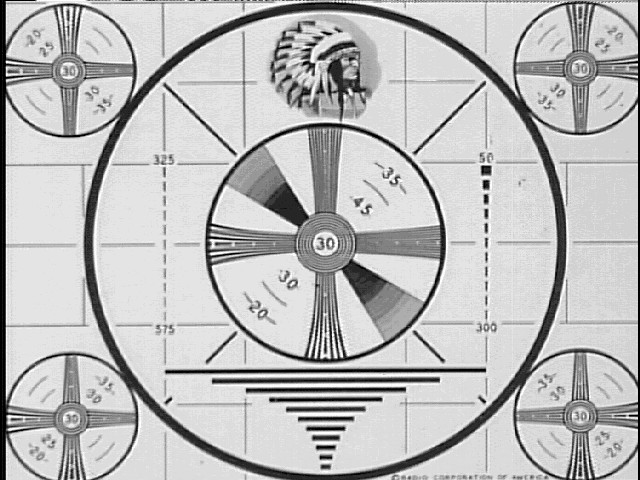

<div align="center">

## TestPattern


</div>

### Description

Simulates an antique rolling indian-head test pattern

using the up and down movement of the mouse as a vertical

hold control. Uses StretchBlt to resize the image to

current resolution. Have fun...
 
### More Info
 


<span>             |<span>
---                |---
**Submitted On**   |2002-09-06 09:26:26
**By**             |[D\.W\.](https://github.com/Planet-Source-Code/PSCIndex/blob/master/ByAuthor/d-w.md)
**Level**          |Intermediate
**User Rating**    |5.0 (15 globes from 3 users)
**Compatibility**  |VB 6\.0
**Category**       |[Graphics](https://github.com/Planet-Source-Code/PSCIndex/blob/master/ByCategory/graphics__1-46.md)
**World**          |[Visual Basic](https://github.com/Planet-Source-Code/PSCIndex/blob/master/ByWorld/visual-basic.md)
**Archive File**   |[TestPatter127591962002\.zip](https://github.com/Planet-Source-Code/d-w-testpattern__1-38721/archive/master.zip)

### API Declarations

```
Private Declare Function ClientToScreen Lib "user32" (ByVal hWnd As Long, lpPoint As POINTAPI) As Long
Private Declare Function SetCursorPos Lib "user32" (ByVal X As Long, ByVal Y As Long) As Long
Private Declare Function StretchBlt Lib "gdi32" (ByVal hdc As Long, ByVal X As Long, ByVal Y As Long, ByVal nWidth As Long, ByVal nHeight As Long, ByVal hSrcDC As Long, ByVal xSrc As Long, ByVal ySrc As Long, ByVal nSrcWidth As Long, ByVal nSrcHeight As Long, ByVal dwRop As Long) As Long
Private Declare Function GetCursorPos Lib "user32" (lpPoint As POINTAPI) As Long
Private Const SRCCOPY = &HCC0020
```


